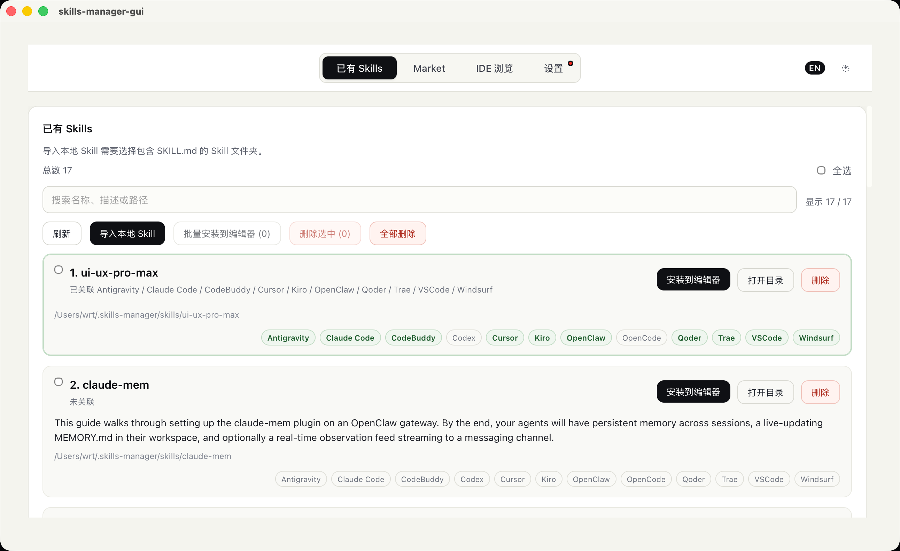
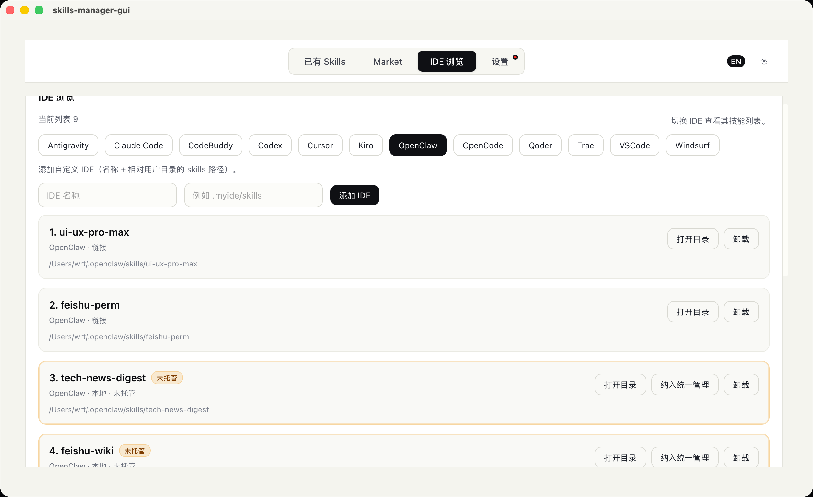

# Skills Manager

[English](README.md) | [中文](README_zh-CN.md)

**多市场聚合搜索，一键极速安装至 10+ 款 AI IDE。** 
一款专业的跨平台 AI Skills 管理器。支持从各大主流技能市场（如 Claude Plugins、SkillsLLM、SkillsMP 等）进行聚合搜索，一键下载至统一的本地仓库，并可通过符号链接（Symlink）极速分配到任意受支持的 AI 开发环境中。全面兼容 Windows、macOS 与 Linux 操作系统，让您的 AI 编程助手能力无限扩展。





## ✨ 核心特性

- 🔍 **聚合市场检索**：基于公开 Registry，一站式搜索全网优质 Skills
- 📦 **统一本地仓库**：集中化管理下载内容 (`~/.skills-manager/skills`)
- 🚀 **一键极速分发**：以系统软链接形式，将统一的本地 Skills 秒级安装至各个目标 IDE
- 🛠️ **多维管理界面**：支持基于 IDE 的细粒度浏览、无痕安全卸载机制
- ⚙️ **高度可定制性**：全面拥抱小众编辑器，支持一键添加自定义 IDE（自定义名称与相对路径）
- 🔄 **内置版本控制**：若市场端存在新版本，支持在本地随时一键无缝更新
- 🆕 **静默更新检测**：每次启动应用都会自动检测最新稳定的 GitHub Release，通过弹窗优雅提示更新

## 🎯 原生支持的 IDE（按字母顺序）

- **Antigravity**: `.gemini/antigravity/skills`
- **Claude Code**: `.claude/skills`
- **CodeBuddy**: `.codebuddy/skills`
- **Codex**: `.codex/skills`
- **Cursor**: `.cursor/skills`
- **Kiro**: `.kiro/skills`
- **OpenClaw**: `.openclaw/skills`
- **OpenCode**: `.config/opencode/skills`
- **Qoder**: `.qoder/skills`
- **Trae**: `.trae/skills`
- **VSCode**: `.github/skills`
- **Windsurf**: `.windsurf/skills`

## 📖 使用指南

### 📥 获取与使用

- **普通用户（推荐）**：直接前往 [Releases 页面](https://github.com/Rito-w/skills-manager/releases) 下载最新版本安装包即可。
- **开发者**：拉取源码在本地运行，或进行深度定制。

### 🍎 macOS 安全使用要求

由于目前暂时未配置 Apple 开发者商业证书，初次打开应用可能会遇到“已损坏，无法打开”或提示“未知的开发者”等系统拦截。作为开发者或极客用户，您可以在终端执行以下命令进行安全放行：

```bash
xattr -dr com.apple.quarantine "/Applications/skills-manager-gui.app"
```

### 🔍 1) 市场浏览 (Market)

- 基于配置好的服务源，聚合展示全网可用的优质 Skills。
- 点击下载将自动入库至本地，若本地仓库已存在较旧版本，将高亮显示“更新”按钮。

### 🗂️ 2) 本地仓库 (Local Skills)

- 集中俯瞰已下载到设备底层仓库的所有 Skills。
- 点击“安装”，即可在弹出的面板中勾选一个或多个原生 / 自定义的 IDE 实施批量挂载发布。

### ⌨️ 3) IDE 纬度管理 (IDE Browse)

- 灵活切换工作环境视角（如 VSCode 或 Cursor），独立查看各自已挂载使用的技能列表。
- 安全卸载模块：仅安全移除软链接；若非软链接则执行物理剔除，相互防干扰。
- 找不到您的生产力工具？只需在右上角轻松创建你的“自定义 IDE”。

## 👨‍💻 安装与开发

### 环境依赖

- Node.js (建议 LTS)
- Rust (通过 rustup 安装)
- macOS: Xcode Command Line Tools

### 本地开发

```bash
pnpm install
pnpm tauri dev
```

### 打包发布

```bash
pnpm tauri build
```

## 📡 远程数据来源

- **Claude Plugins**: `https://claude-plugins.dev/api/skills`
- **SkillsLLM**: `https://skillsllm.com/api/skills`
- **SkillsMP**: `https://skillsmp.com/api/v1/skills/search`（由于跨域限制可能需要提供 API Key 配置）
- 下载 ZIP 请求代理: `https://github-zip-api.val.run/zip?source=<repo>`

## 🛠 技术栈

- 桌面端核心框架：**Tauri 2**
- 前端视图层：**Vue 3** + **TypeScript** + **Vite**
- 底层文件与系统逻辑：**Rust** (命令侧)

## 📄 License

TBD
